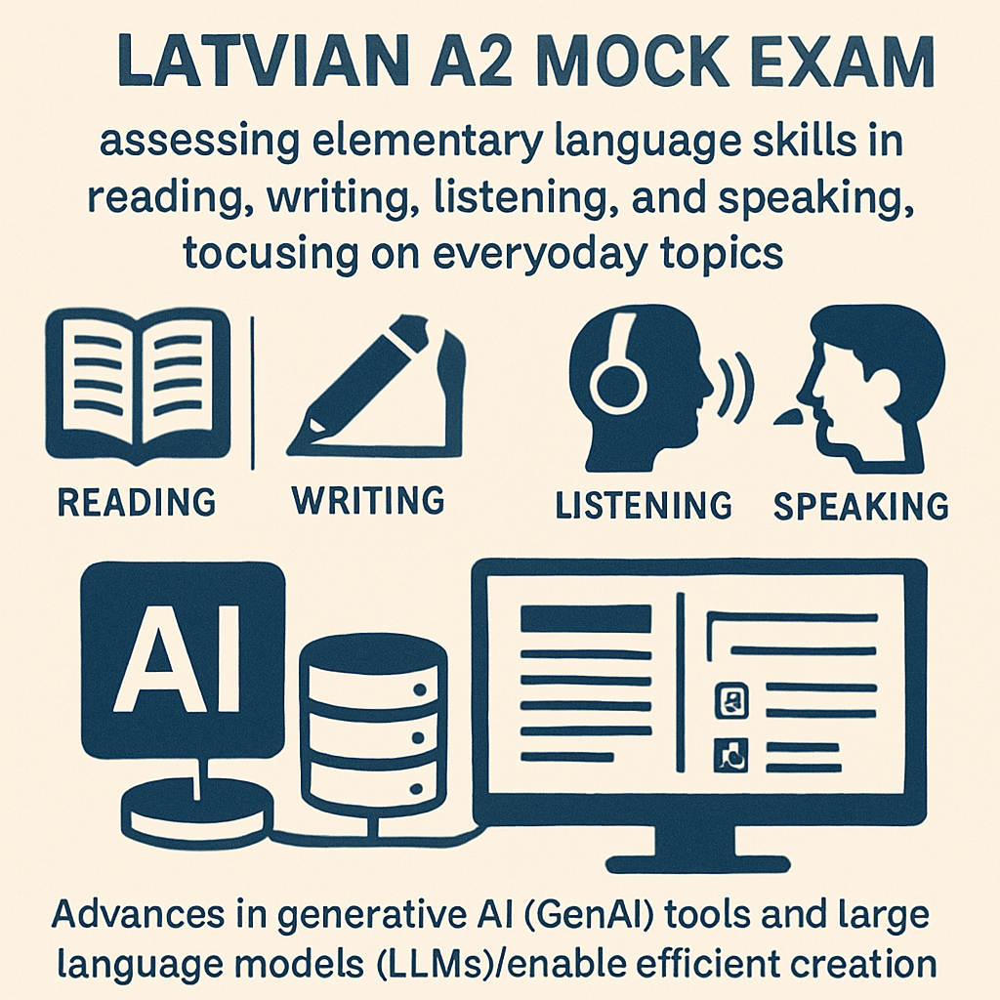

# Welcome to the Latvian A2 Mock Exam:

Latvian A2 Mock Exam: Creation Using GenAI Tools and LLMs

A Latvian A2 mock exam is designed to assess elementary-level language skills, focusing on reading, writing, listening, and speaking. The A2 level corresponds to the ability to understand and use basic Latvian in everyday situations, such as introducing oneself, talking about family, work, shopping, and daily routines.

With advancements in generative AI (GenAI) tools and large language models (LLMs), creating such mock exams has become more efficient, interactive, and tailored to learners’ needs.

## Key Features of a Latvian A2 Mock Exam

- **Reading Comprehension**: Short texts (e.g., emails, advertisements, or simple articles) followed by multiple-choice or short-answer questions to test understanding.
- **Writing**: Prompts requiring short letters, messages, or responses, focusing on clarity, correct grammar, and vocabulary use.
- **Listening**: Audio clips with simple dialogues or announcements, followed by comprehension questions.
- **Speaking**: Simulated conversations or role-plays where learners answer questions about familiar topics or describe daily activities.

## How GenAI Tools and LLMs Enhance Exam Creation

- **Automated Content Generation**: LLMs can generate diverse reading passages, listening scripts, and writing prompts tailored to the A2 level, ensuring variety and relevance.
- **Personalized Feedback**: AI chatbots can instantly evaluate written and spoken answers, providing targeted feedback on grammar, vocabulary, and pronunciation.
- **Interactive Practice**: AI-powered platforms can simulate exam conditions, offering adaptive exercises and real-time corrections.
- **Scalability**: GenAI tools enable rapid creation of new mock exams, supporting frequent practice and continuous assessment.

## Example Structure for a Latvian A2 Mock Exam (AI-Generated)

| Section   | Task Example                        | AI/LLM Role                     |
|-----------|-------------------------------------|----------------------------------|
| Reading   | Read a short ad and answer 3 questions | Generate text & questions       |
| Writing   | Write a short email to a friend     | Provide prompt & feedback       |
| Listening | Listen to a simple dialogue, answer Qs | Generate audio & questions      |
| Speaking  | Describe your daily routine         | Simulate conversation, assess   |

## Available Resources and Platforms

LatvianOnline.lv and similar platforms offer structured A2 courses and mock exams, often with interactive exercises and personal feedback from teachers.

AI-powered chatbots (like Tilde’s Digne) are being integrated into e-learning systems, providing personalized support, instant feedback, and dynamic content generation for language learners.

## Summary

Using GenAI tools and LLMs to create Latvian A2 mock exams enables:

- Fast, scalable, and diverse test content generation
- Immediate, personalized feedback for learners
- Interactive and adaptive practice environments
- Enhanced preparation for state exams and real-life communication

Such AI-enhanced mock exams are transforming language learning by making it more accessible, efficient, and tailored to individual needs.

<iframe src="files/Mock_Exam_1.pdf" width="100%" height="600px">
    This browser does not support PDFs. Please download the PDF to view it: <a href="files/Mock_Exam_1.pdf">Download PDF</a>.
</iframe>

<iframe src="files/a_2_limenis.pdf" width="100%" height="600px">
    This browser does not support PDFs. Please download the PDF to view it: <a href="files/a_2_limenis.pdf">Download PDF</a>.
</iframe>
